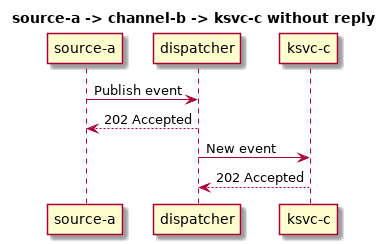
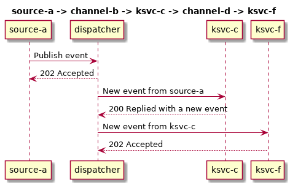

# KFN DSL Design Document

## How Knative Eventing works 

### How to connect Knative services

First of all, you can't connect a Knative services to another one directly, but you need a `Channel`. That means that a a Knative service **can't** be used as a flow start, that's why `Source` concept exists

A `Channel` has an input address that you can feed with events and those are routed to the subscribed Knative services.
 
To subscribe to a channel, you must create a `Subscription`. Every subscribed ksvc to a channel receives **all** events.

In the subscription, you must define what channel you want to subscribe, what service wants to subscribe and an optional reply service/channel to route the response.

For an example on how to create a `Channel` and a `Subscription`, look here: https://github.com/matzew/knative-eventing-samples/tree/master/02-source_channel

`Source` implementations send cloudevents as HTTP requests with cloudevents go-sdk client to an http target, whose address is injected with environment variables by the `sources-controller`.

That means that, when you declare the `Source`, you must declare the "sink" (where the `Source` must send events)

## How Eventing routes the events

All `Channel`s are implemented with a single service called channel dispatcher. This dispatcher manages all requests and responses to channels inside the cluster.

---

Example HTTP request/response flow for: source-a -> channel-b -> ksvc-c

To connect channel-b to ksvc-c, ksvc-c declares a subscription to channel-b



---

Example HTTP request/response flow for: source-a -> channel-b -> ksvc-c -> channel-d -> ksvc-f

To connect channel-b to ksvc-c to channel-d, ksvc-c declares a subscription to channel-b with **reply** to channel-d



## DSL Design

### Goal

The goal of the dsl is provide an easy and intuitive way to define events flow starting from functions, 
without manually creating yamls for `Channel`s, `Subscription`s, Knative `Service`s etc.

The language should provide a semantic to:

* Define what functions, sources or just ksvc developer wants to use in the flow
* How to wire the defined resources to create an event flow.

The tool:
 
* Should recognize the language and validate the syntax and semantic
* Build all required functions and push images to a registry
* Expand the event flow to match Knative Eventing needs (e.g. the developer declares that ksvc-a connects to ksvc-b, so the tool should generate a channel to put in the middle)
* Produce an output ready to use for kubectl to deploy the flow (In future we could directly apply changes to the cluster?)

### Definition of terms

* Component: Everything that can receive events, send events or both. It could be a ksvc, a `Channel`, a `Source` or a `Function`. You can find all supported components in [component](../pkg/dsl/component)
* Wire: A flow of events, defined through a connection of components

### Language statements

There are two kind of statements:

* Component declaration: `service_one: Function "service.rs"`
* Wire declaration: `source_cron -> service_two -> "service_three.rs" -> KafkaChannel -> service_two`

Note: wire declarations support "anonymous" definition of components, e.g. in the example above the `KafkaChannel` is an anonymous declaration of a `KafkaChannel` component and `"service_three.rs"` is an anonymous declaration of a `Function`

### Language implementation

The DSL is defined through a grammar in [ANTLR4](https://www.antlr.org/), located at [Kfn.g4](../dsl/Kfn.g4). An example kfn description:

```
service_one: Function "service.rs"
service_two: Function "example.rs"
source_cron: CronSource with schedule "*/2 * * * *" and data "Hello kfn!"

source_cron -> service_two -> "service_three.rs" -> KafkaChannel -> service_two
```

Antlr generates the lexer and parser for the language.

The output of the parser is a syntax tree, that is the input of the "compilation".

The "compilation" goes through the following phases:

1. [`CreateDeclSymbolTable`](../pkg/dsl/create_symbol_table.go): Creates a symbol table from declaration statements, without parsing it
2. [`RemoveAnonymousSymbols`](../pkg/dsl/remove_anonymous_symbols.go): Adds to the symbol table the anonymous declarations inside wires
3. [`ParseSymbolValues`](../pkg/dsl/parse_symbol_values.go): Parse symbols to component models
4. [`ParseWires`](../pkg/dsl/parse_wires.go): Parse wire definitions
5. [`CheckAndExpandWires`](../pkg/dsl/check_wires.go): Check and expand wires to match Eventing needs
6. [`BuildAllFunctionImages`](../pkg/dsl/build_all_functions.go): Build all functions using the same logic of `kfn build` command
7. [`CreateAllResources`](../pkg/dsl/create_all_resources.go) & [`CreateAllWireResources`](../pkg/dsl/create_all_wire_resources.go): Create yamls for all components and subscriptions to connect them
8. Output yamls to specified file output
9. Optional [`GenerateDigraph`](../pkg/dsl/generate_digraph.go): Generate graph in dot notation of the expanded flow